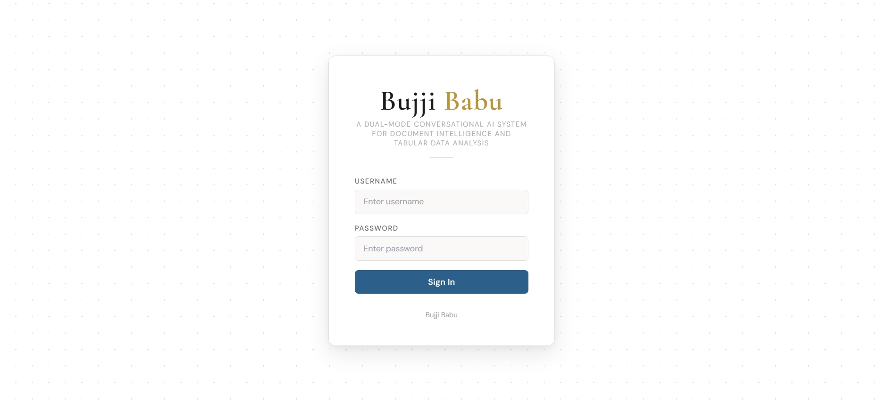
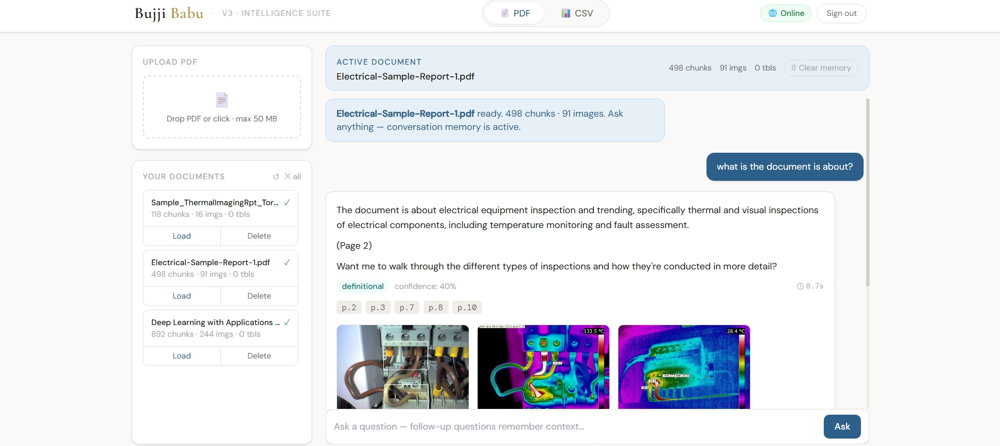
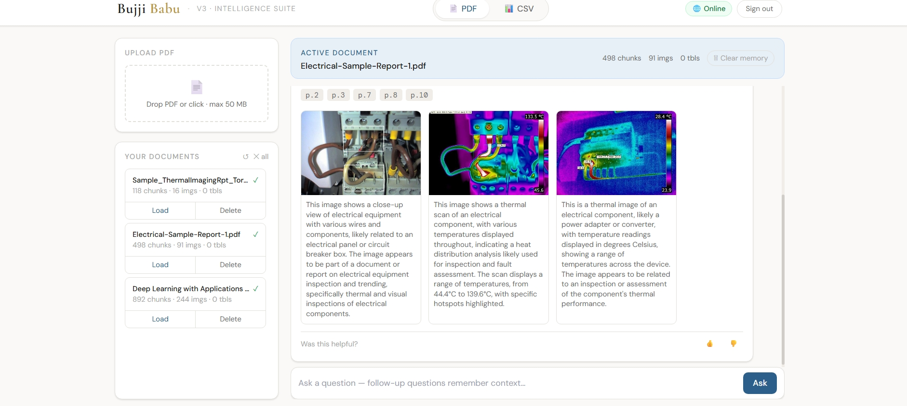
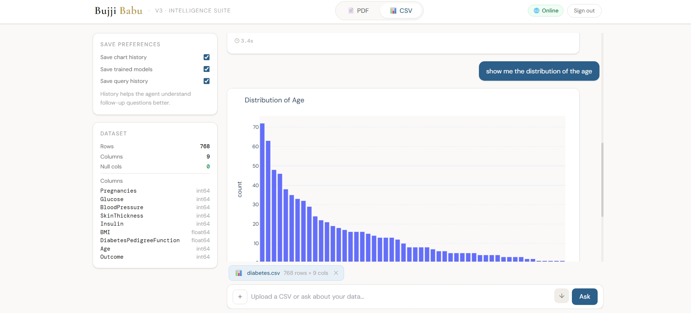

# Bujji Babu — AI RAG Platform

> PDF intelligence + CSV analytics on a single, production-grade backend.  
> Ask questions about documents. Visualize and model your data. Export everything.

---

## What it does

Bujji Babu ships two independent AI engines behind a single FastAPI server:

| Engine | What you get |
|---|---|
| **PDF RAG** | Upload any PDF → semantic retrieval → streaming answer with page citations and relevant image extraction |
| **CSV Analytics** | Upload any CSV → ask in plain English → get charts, ML models, correlation heatmaps, filtered tables, and natural-language summaries |

Both engines share one auth layer, one SQLite store, and one streaming SSE interface.

---

## Screenshots

### Login
> Add your screenshot here — `docs/screenshots/login.png`



---

### PDF RAG — streaming factual answer with citations
> Add your screenshot here — `docs/screenshots/pdf_rag_answer.png`



---

### PDF RAG — relevant image surfaced from document
> Add your screenshot here — `docs/screenshots/pdf_rag_image.png`



---

### CSV Analytics — live chart rendering
> Add your screenshot here — `docs/screenshots/csv_chart.png`



---


## Why there is a login

Without authentication every visitor would share the same upload sessions, the same conversation history, and the same Groq API quota.

The JWT-based login ties every PDF upload, CSV session, query, and trained model to a specific `user_id`. This gives you:

- **Session isolation** — your chat history is yours; other users never see it
- **API cost control** — each user's queries are attributable; rate-limiting per account is straightforward to add
- **Secure model storage** — trained `.pkl` files are namespaced so users cannot access each other's models
- **Multi-tenancy foundation** — the DB schema is already user-aware; adding roles or quotas requires no structural changes

---

## Feature overview

### PDF pipeline
- Adaptive chunking with overlap for dense technical documents
- ChromaDB vector store — cosine similarity retrieval, top-k reranking
- Confidence scoring on retrieved chunks before sending to LLM
- Page-level source citations in every answer
- VLM image scoring — figures, charts, and photos are ranked for relevance and surfaced alongside the answer
- RAGAS-style faithfulness + relevance evaluation endpoint
- Full token-streaming via SSE so the first word appears in ~200 ms

### CSV pipeline
- Natural language → Plotly chart (bar, line, scatter, heatmap, box, histogram, pie)
- Correlation matrix with significance annotations
- Automatic ML: detects classification vs regression, trains Random Forest / Logistic Regression / Gradient Boosting, reports CV accuracy
- Model comparison bar chart — side-by-side accuracy/R²/RMSE with best-model callout
- NL filter expressions — "show rows where salary > 80000 and department is Engineering"
- Statistical summary artifacts — mean, median, std, quartiles rendered in the PDF export
- Auto-fix retry loop — if generated code errors, the agent rewrites it with the error message as context
- Per-session SQLite history — re-upload the same file and continue exactly where you left off
- PDF export — full session as a styled report with embedded charts, stat tables, and markdown

---

## Tech stack

| Layer | Technology |
|---|---|
| Backend | FastAPI + Uvicorn |
| LLM inference | Groq API (llama-3.3-70b, llava-v1.5-7b) |
| Local/offline LLM | Ollama (switchable at runtime via `/set-mode`) |
| Vector store | ChromaDB |
| Embeddings | HuggingFace `sentence-transformers` |
| Data viz | Plotly (interactive) + kaleido (PNG for export) |
| ML | scikit-learn |
| PDF parsing | PyMuPDF (fitz) |
| PDF export | ReportLab |
| Session store | SQLite (via `bujji.db`) |
| Auth | JWT (`python-jose`) |
| Frontend | Vanilla JS + Tailwind CSS (CDN) |
| Streaming | Server-Sent Events (SSE) with asyncio Queue |

---

## Project structure

```
bujji-babu-rag-analytics/
├── main.py                    # FastAPI app — all HTTP routes
├── auth.py                    # JWT login, register, token verify
├── core/
│   └── llm_client.py          # Groq + Ollama client, mode switching
├── pdf/
│   ├── ingestion.py           # PDF → chunks → ChromaDB
│   ├── query.py               # RAG retrieval + answer streaming
│   ├── vision.py              # VLM image scoring and reranking
│   └── ragas_eval.py          # Faithfulness + relevance scoring
├── csv_pipeline/
│   ├── csv_agent.py           # Main router: chart / model / filter / stats
│   ├── model_selector.py      # Task detection, training, comparison code gen
│   ├── nl_filter.py           # NL → pandas filter expression
│   ├── correlation.py         # Correlation heatmap builder
│   └── csv_session.py         # SQLite session + history persistence
├── utils/
│   └── chat_exporter.py       # PDF report generation (ReportLab + kaleido)
├── static/
│   └── index.html             # Single-page frontend
├── .env.example               # Environment variable template
├── requirements.txt
└── .gitignore
```

---

## Quick start

```bash
# 1. Clone
git clone https://github.com/GANDHAMMANI/bujji-babu-rag-analytics.git
cd bujji-babu-rag-analytics

# 2. Create virtual environment
python -m venv .venv
source .venv/bin/activate          # Windows: .venv\Scripts\activate

# 3. Install dependencies
pip install -r requirements.txt

# 4. Configure environment
cp .env.example .env
# Edit .env and add your GROQ_API_KEY and SECRET_KEY

# 5. Start the server
uvicorn main:app --reload --host 0.0.0.0 --port 8000
```

Open `http://localhost:8000` in your browser.

---

## Environment variables

```env
# Required
GROQ_API_KEY=gsk_your_groq_api_key_here
SECRET_KEY=your_jwt_secret_key_here

# Optional — for local GPU / offline mode
OLLAMA_HOST=http://localhost:11434
```

Copy `.env.example` to `.env` and fill in your values. **Never commit `.env`.**

---

## Offline / GPU mode

The app can switch between Groq (cloud) and Ollama (local GPU) at runtime:

```
POST /set-mode   body: {"mode": "ollama"}   # switch to local
POST /set-mode   body: {"mode": "groq"}     # switch to cloud
```

When Ollama is running and a compatible model is pulled (`ollama pull llama3`), all inference routes locally — zero API cost, full data privacy.

---

## API overview

| Method | Route | Description |
|---|---|---|
| `POST` | `/register` | Create account |
| `POST` | `/login` | Get JWT token |
| `POST` | `/upload-pdf` | Ingest PDF into ChromaDB |
| `POST` | `/ask-stream` | Stream answer from PDF RAG (SSE) |
| `POST` | `/upload-csv` | Ingest CSV, run EDA |
| `POST` | `/csv-ask-stream` | Stream answer from CSV agent (SSE) |
| `GET` | `/export-chat/{csv_id}` | Download session as PDF report |
| `GET` | `/sessions` | List all CSV sessions |

---

## Security notes

- All uploaded files, trained models, and chat history are stored locally — nothing leaves your server
- `.env` and all secret files are excluded from git via `.gitignore`
- Groq API keys must be rotated if ever committed accidentally — GitHub push protection will flag them
- The `bujji.db` SQLite file contains user credentials and chat history — keep it out of version control

---

## License

MIT
